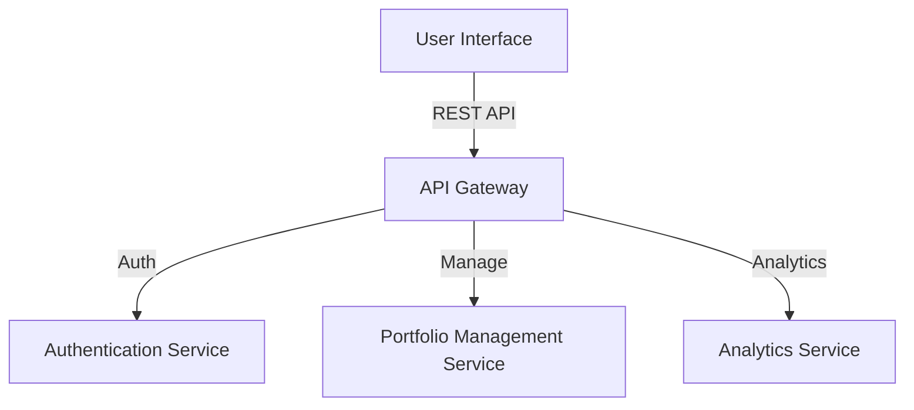

# Architecture Overview

## Passive Income Portfolio Application

The Passive Income Portfolio application is designed to provide users with an easy-to-use interface to track and manage their passive income streams. The architecture follows a microservices approach, ensuring that each component can scale independently and communicate through APIs.

### Components:
1. **User Interface**: Built with React, providing a responsive interface for users.
2. **API Gateway**: Serves as a single entry point for client requests, routing them to the appropriate microservice.
3. **Authentication Service**: Handles user authentication and authorization.
4. **Portfolio Management Service**: Manages user portfolios, including CRUD operations on income streams.
5. **Analytics Service**: Provides insights and analytics on user portfolios.

### Mermaid Diagram
